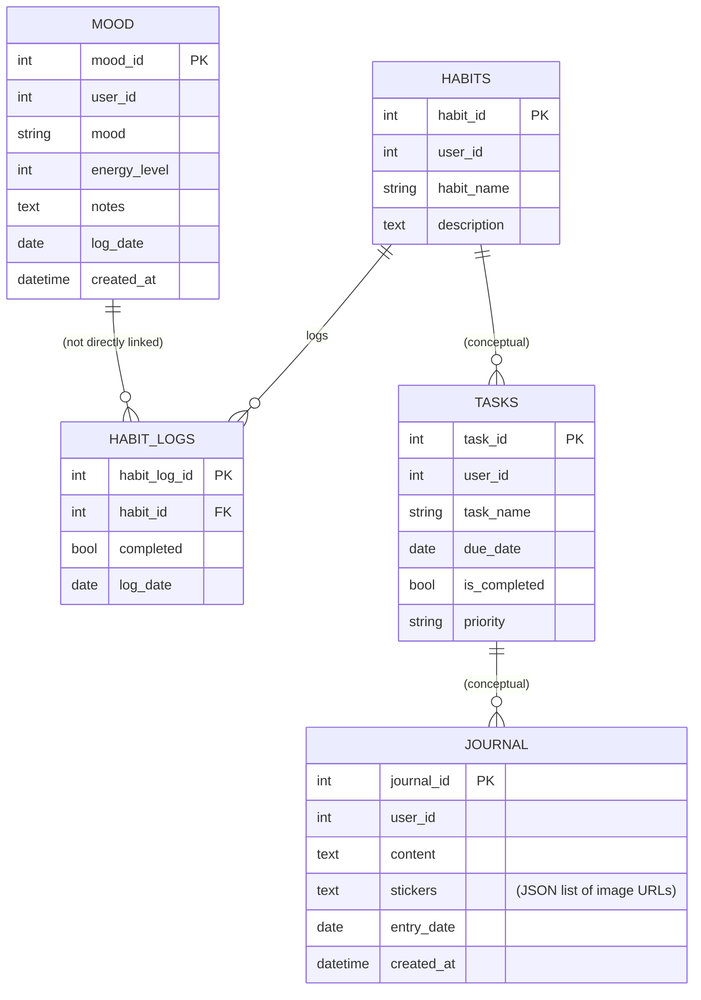
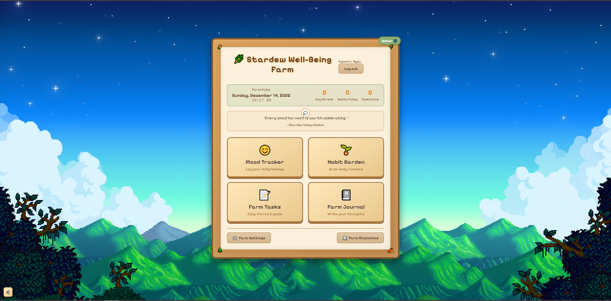
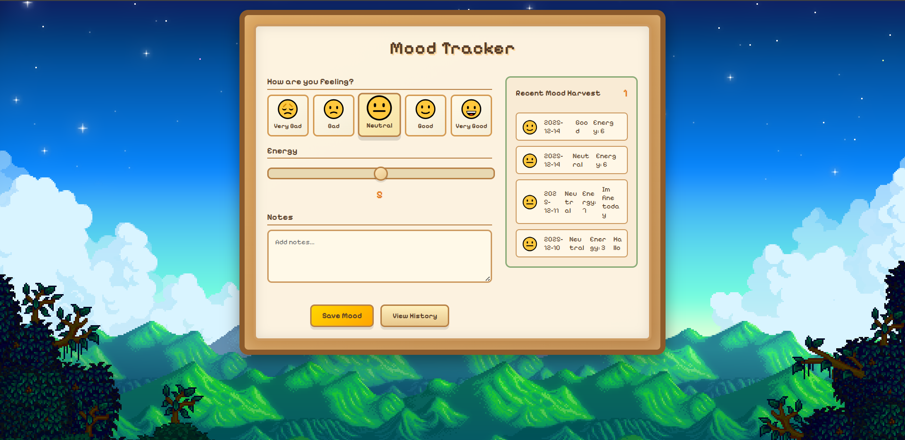
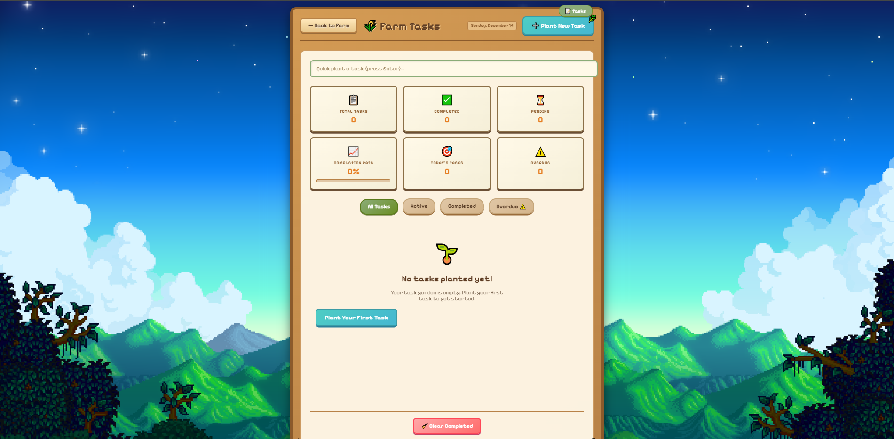

<!--
  Stardew Valley Well-Being Farm
  README - thematic, with emojis and Mermaid ERD
 -->

<div align="center">
  <h1>🌿 Stardew Well-Being Farm</h1>
  <p><em>A cozy personal tracker for habits, mood, tasks and journaling — Stardew-styled.</em></p>
</div>

---

## Overview

Welcome to the Stardew Well-Being Farm — a small single-user Flask app that helps you track daily mood, cultivate habits, manage tasks, and keep a farm journal. The UI is intentionally styled with a pixel / Stardew-inspired theme, with calm colors and playful icons to make habit-building feel like tending a virtual farm. 🌾

- Mood tracking with energy levels and notes
- Habit garden with simple logging
- Task list with due dates and completion
- Journal with image uploads and entry editing
- Farm Statistics and Settings pages

---

## ERD (Entity Relationship Diagram)

Below is a Mermaid ERD representing the main tables used by the application. Paste this into a Markdown viewer that supports Mermaid (e.g., GitHub) to render the diagram.



---

## How to run (Windows examples)

1. Clone or open this project folder.
2. Create a Python virtual environment and install dependencies.

```powershell
python -m venv .venv
.\.venv\Scripts\activate
pip install -r requirements.txt
```

3. Start the server:

```powershell
python app_fixed.py
```

4. Open your browser at: http://localhost:5000

Notes:
- Place any uploaded images into `static/uploads/` (the upload endpoint will save near there).
- To enable site music, put your music file at `static/audio/stardew_theme.mp3`.

---

## Screenshots

Add your screenshots in `static/img/screenshots/` and then replace the filenames below. Example placeholders:

<div style="display:flex;gap:12px;flex-wrap:wrap;">
  <div style="width:320px">
    
    <p style="text-align:center;margin:6px 0 14px 0">Dashboard</p>
  </div>
  <div style="width:320px">
    
    <p style="text-align:center;margin:6px 0 14px 0">Mood</p>
  </div>
  <div style="width:320px">
    
    <p style="text-align:center;margin:6px 0 14px 0">Habit</p>
  </div>
  <div style="width:320px">
    
    <p style="text-align:center;margin:6px 0 14px 0">Tasks</p>
  </div>
  <div style="width:320px">
    
    <p style="text-align:center;margin:6px 0 14px 0">Journal</p>
  </div>
  <div style="width:320px">
    
    <p style="text-align:center;margin:6px 0 14px 0">Settings</p>
  </div>
</div>


## Thank you 🌟

Thanks for using the Stardew Well-Being Farm — may your days be calm, your crops plentiful, and your habits steady. If you'd like, I can help add more pages, bundle assets (fonts/music), or wire settings to a user model.

<p align="center">🍀 Happy farming! — The Tiny Farmhands</p>
